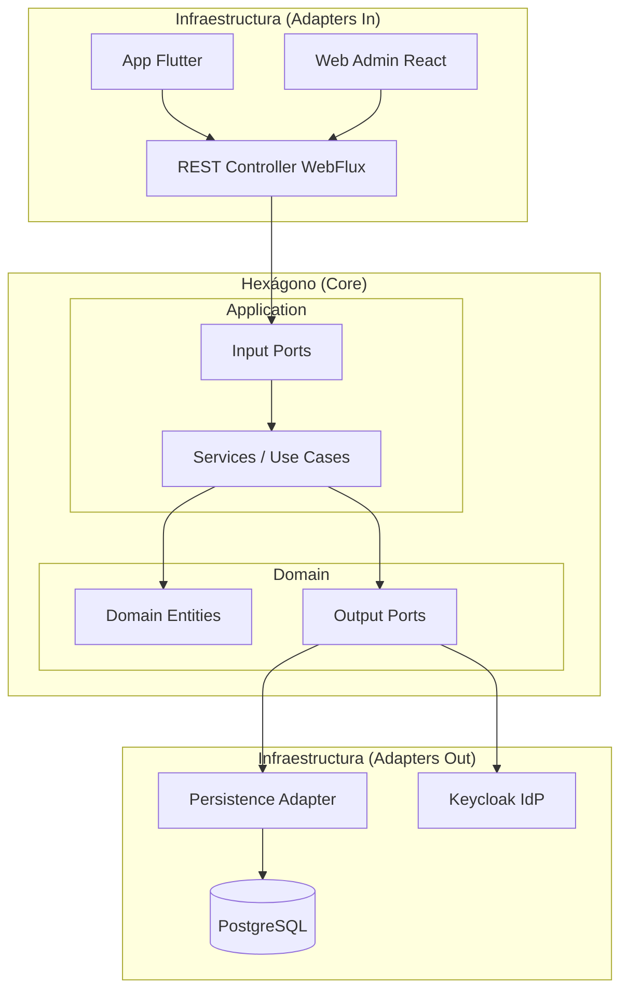

# PROYECTO INTEGRADOR: SISTEMA DE GESTIÓN LOGÍSTICA "ECOROUTE"

---

## 📋 Resumen Ejecutivo

El presente proyecto, denominado **"EcoRoute"**, consiste en el desarrollo de una solución de software integral para la optimización de la logística de última milla de la empresa **"TransLogística Express S.A.C."**. 

La solución aborda la problemática de la falta de trazabilidad en tiempo real y la ineficiencia en la asignación de rutas manuales. El sistema permite centralizar la información de pedidos, automatizar la asignación a conductores y realizar un seguimiento GPS preciso, mejorando la transparencia hacia el cliente final y reduciendo costos operativos de combustible y tiempo.

El sistema está construido bajo una arquitectura de microservicios modulares con **Arquitectura Hexagonal**, utilizando:
- **Backend:** Java 17, Spring Boot 3.x y WebFlux para concurrencia reactiva.
- **Seguridad:** OAuth2/OIDC con **Keycloak**.
- **Mobile:** Flutter para conductores.
- **Base de Datos:** PostgreSQL con R2DBC.
- **Infraestructura:** Docker y Docker Compose.

**Palabras clave:** Logística, Arquitectura Hexagonal, WebFlux, Keycloak, Flutter, Scrum, Docker.

---

## 🎯 Introducción

En el competitivo sector logístico actual, la eficiencia en la denominada **"última milla"** define la rentabilidad operativa y la satisfacción del cliente final. **TransLogística Express S.A.C.** enfrenta desafíos críticos debido a procesos manuales basados en hojas de cálculo que resultan en errores de entrega y falta de visibilidad para el cliente.

Este documento detalla la investigación, análisis, diseño e implementación del sistema EcoRoute. Se justifica la elección de tecnologías reactivas (WebFlux) debido a la naturaleza de los datos en tiempo real (GPS) y la necesidad de escalabilidad. El documento se estructura en cinco capítulos que abarcan desde el análisis del negocio y la planificación estratégica, hasta la ejecución técnica bajo estándares de arquitectura limpia y el aseguramiento de la calidad del software.

---

# 📊 CAPÍTULO I: ANÁLISIS DEL NEGOCIO

## 1.1 Generalidades

### 1.1.1 Descripción de la Organización
**TransLogística Express S.A.C.** es una empresa peruana líder en el transporte de carga liviana y distribución e-commerce en Lima Metropolitana, enfocada en brindar servicios rápidos y seguros a empresas de retail.

### 1.1.2 Historia de la Organización
| Año | Hito |
|-----|------|
| **2019** | Fundación de la empresa con 2 unidades de transporte. |
| **2021** | Pivote estratégico hacia servicios de última milla por el auge del e-commerce. |
| **2023** | Expansión de flota a 15 unidades propias. |
| **2025** | Colapsos operativos identificados por gestión manual (Excel/WhatsApp). |

### 1.1.3 Visión Empresarial
"Consolidarnos al 2028 como el socio estratégico de logística inteligente más confiable de Perú, liderando la transformación digital del sector."

### 1.1.4 Misión Empresarial
"Brindar soluciones logísticas de última milla eficientes, seguras y transparentes, superando las expectativas de entrega de nuestros clientes mediante tecnología de vanguardia."

### 1.1.5 Organigrama y funciones de las principales áreas
- **Gerencia General:** Dirección estratégica y toma de decisiones globales.
- **Operaciones:** Gestión de flota, despacho y almacén de tránsito.
- **TI (Tecnología):** Soporte técnico, mantenimiento de infraestructura y desarrollo de software.
- **Recursos Humanos:** Reclutamiento de conductores y personal administrativo.
- **Comercial:** Relación con clientes retail y captación de nuevas cuentas.

## 1.2 Análisis FODA
| Fortalezas | Debilidades |
|------------|-------------|
| 1. Flota propia y moderna.   2. Personal con alta experiencia en rutas.   3. Equipo de TI interno capacitado. | 1. Dependencia extrema de procesos manuales.   2. Nula trazabilidad digital para el cliente.   3. Infraestructura de servidores obsoleta. |
| **Oportunidades** | **Amenazas** |
| 1. Crecimiento sostenido del e-commerce.   2. Disponibilidad de tecnologías Cloud y Open Source.   3. Posibilidad de expansión a provincias. | 1. Competencia de startups tecnológicas (Rappi, Olva).   2. Inestabilidad de precios de combustible.   3. Inseguridad ciudadana en zonas de entrega. |

## 1.3 Mapa de Procesos
- **Procesos Estratégicos:** Planeamiento operativo, Gestión de calidad.
- **Procesos Operativos:** Recepción de carga, Asignación de rutas, Ejecución de entrega, Gestión de evidencias.
- **Procesos de Apoyo:** Mantenimiento de flota, Soporte TI, Facturación.

### 1.3.1 Proceso(s) a Automatizar
**"Asignación y Seguimiento de Rutas de Entrega"**: Desde la carga masiva de pedidos hasta la confirmación de entrega con firma y foto por parte del conductor.

## 1.4 Identificación de las Necesidades (Problema u Oportunidad)
- **Problema:** Saturación de líneas telefónicas por clientes consultando el estado de sus pedidos ("¿Dónde está mi paquete?").
- **Oportunidad:** Optimización del uso de combustible y reducción de tiempos de entrega mediante rutas calculadas digitalmente.

## 1.5 Elicitación de Requisitos

### Requisitos Funcionales (RF)
| ID | Detalle |
|----|---------|
| RF-01 | El sistema debe permitir la carga masiva de pedidos mediante archivos CSV. |
| RF-02 | El sistema debe asignar automáticamente pedidos a conductores según disponibilidad. |
| RF-03 | La App móvil debe permitir al conductor cambiar el estado a "En Ruta", "Entregado" o "Fallido". |
| RF-04 | La App móvil debe capturar foto y firma digital como evidencia de entrega. |
| RF-05 | El sistema debe mostrar la ubicación GPS del conductor en tiempo real en un mapa administrativo. |

### Requisitos No Funcionales (RNF)
| ID | Detalle |
|----|---------|
| RNF-01 | La arquitectura debe ser reactiva utilizando Spring WebFlux para manejar alta concurrencia. |
| RNF-02 | La seguridad debe basarse en OAuth2 con Keycloak para autenticación y autorización. |
| RNF-03 | El sistema debe garantizar una disponibilidad del 99.5%. |
| RNF-04 | La interfaz móvil debe ser intuitiva y usable en condiciones de alta luz solar. |

## 1.6 Análisis del Problema y Propuesta de Solución
La falta de integración entre el despacho y el conductor genera vacíos de información. Se propone el sistema **EcoRoute**, una plataforma web/móvil que centraliza la comunicación y el flujo de datos.

### 1.6.1 Alternativas de Solución
- **SaaS Comercial (Beetrack/Route4Me):** Alto costo recurrente por unidad y poca flexibilidad para reglas de negocio propias.
- **Desarrollo In-house (EcoRoute):** Permite control total de datos, integración con sistemas locales y escalabilidad a medida. **(Elegida)**.

## 1.7 Factibilidad del Proyecto
- **Técnica:** El equipo domina Java/Spring y Flutter. La arquitectura hexagonal asegura mantenibilidad.
- **Operativa:** Los conductores cuentan con smartphones Android/iOS. El personal administrativo está dispuesto a abandonar el Excel.
- **Económica:** Inversión inicial estimada compensada por el ahorro de 20% en costos de transporte en el primer año.

---

# 📅 CAPÍTULO II: PLANIFICACIÓN DEL PROYECTO

## 2.1 Enfoque de Gestión del Proyecto y del Ciclo de Vida a Aplicar

El proyecto **EcoRoute** adoptará un enfoque de gestión **Ágil** basado en el marco de trabajo **Scrum**. Este enfoque se selecciona debido a la naturaleza evolutiva de los requisitos en el sector logístico y la necesidad de entregar valor de manera incremental y constante.

El Ciclo de Vida del desarrollo será **Iterativo e Incremental**, estructurado en **Sprints de 2 semanas**. Cada sprint resultará en un incremento de producto potencialmente entregable, permitiendo validar funcionalidades con los stakeholders (conductores y despachadores) de forma temprana.

**Ceremonias de Scrum a aplicar:**
- **Sprint Planning:** Al inicio de cada iteración para definir el *Sprint Backlog*.
- **Daily Scrum:** Reuniones diarias de 15 minutos para sincronización del equipo.
- **Sprint Review:** Demostración del incremento al Product Owner y stakeholders al final del sprint.
- **Sprint Retrospective:** Análisis de mejora continua del proceso al cierre del sprint.

## 2.2 Justificación del enfoque del proyecto a aplicar

La elección de Scrum y un ciclo de vida iterativo se justifica por los siguientes factores:

1.  **Incertidumbre de Requisitos:** Los procesos de última milla pueden variar según la retroalimentación en campo (ej. problemas de señal, usabilidad de la app en movimiento), lo que hace inviable una planificación rígida tipo *Waterfall*.
2.  **Time-to-Market:** La necesidad de solucionar el colapso operativo actual requiere poner en producción un MVP (Producto Mínimo Viable) lo antes posible, en lugar de esperar meses por el sistema completo.
3.  **Mitigación de Riesgos:** Las entregas frecuentes permiten identificar errores técnicos o de concepto en etapas tempranas, reduciendo el costo del cambio.
4.  **Adaptabilidad:** Permite incorporar cambios regulatorios o nuevas necesidades operativas sin descartar todo el trabajo previo.

## 2.3 Arquitectura del software a utilizar

Se utiliza una **Arquitectura Hexagonal (Ports & Adapters)** para garantizar la independencia del núcleo de negocio respecto a las tecnologías externas, facilitando la mantenibilidad y testabilidad.

### Diagrama de Arquitectura

### 2.3.1 Modelos y artefactos a aplicar
Para asegurar una documentación técnica robusta y un diseño claro, se utilizarán los siguientes artefactos basados en UML y C4:
- **Diagramas de Contexto (C4 Nivel 1):** Para visualizar las interacciones del sistema EcoRoute con sistemas externos (Pasarelas de pago, APIs de Mapas, ERP legado).
- **Diagramas de Contenedores (C4 Nivel 2):** Detallando la distribución de microservicios, bases de datos y aplicaciones móviles/web.
- **Diagramas de Clases (Dominio):** Para modelar las entidades del negocio (`Order`, `Driver`, `Route`) y sus relaciones.
- **Diagramas de Secuencia:** Para modelar flujos críticos como la "Asignación de Ruta" o la "Confirmación de Entrega", detallando la interacción asíncrona entre componentes WebFlux.
- **Diagramas Entidad-Relación (DER):** Para el diseño físico de la base de datos PostgreSQL.

## 2.4 Planificación del Proyecto

### 2.4.1 Enunciado de alcance de proyecto
El proyecto abarca el diseño, construcción, despliegue y validación del sistema "EcoRoute". 
**Incluye:** 
- Back-office web para gestión de pedidos y monitoreo GPS.
- Aplicativo móvil Android para conductores (gestión de estados y evidencias).
- API RESTful segura y escalable.
**Excluye:** 
- Integración con sistemas de contabilidad profunda (SAP).
- Hardware (dispositivos móviles), los cuales serán provistos por la empresa.

### 2.4.2 Objetivos del proyecto (general y específicos)
**Objetivo General:**
Implementar un sistema integral de gestión logística que permita automatizar la asignación de rutas y el seguimiento en tiempo real, reduciendo en un 30% los errores de entrega y optimizando los tiempos operativos para diciembre de 2025.

**Objetivos Específicos:**
1.  **Digitalizar el 100%** de los despachos diarios, eliminando el uso de papel y Excel.
2.  Proveer **trazabilidad en tiempo real** de la flota vehicular mediante GPS.
3.  Implementar un módulo de **evidencia digital** (foto/firma) accesible inmediatamente tras la entrega.
4.  Garantizar una disponibilidad del sistema del **99.5%** mediante arquitectura Cloud/Docker.

### 2.4.3 Beneficios del proyecto
- **Tangibles:** Reducción del gasto de combustible (rutas óptimas), disminución de llamadas al Call Center (clientes autogestionados), eliminación de costos de impresión.
- **Intangibles:** Mejora en la imagen de marca, mayor satisfacción laboral de los conductores (menos burocracia), toma de decisiones basada en datos reales.

### 2.4.4 Cronograma
La ejecución se estima en 4 meses (8 Sprints):
- **Mes 1 (Sprints 1-2):** Configuración de entorno, Arquitectura Base, CRUD de Pedidos y Autenticación (Keycloak).
- **Mes 2 (Sprints 3-4):** Desarrollo de App Móvil (Lista de paradas), Integración GPS básica.
- **Mes 3 (Sprints 5-6):** Módulo de Evidencias (Fotos), Dashboard administrativo en tiempo real, Notificaciones.
- **Mes 4 (Sprints 7-8):** Pruebas de carga, UAT (Pruebas de Aceptación de Usuario), Capacitación y Despliegue a Producción.

### 2.4.5 Interesados (Stakeholders)
| Interesado | Rol | Nivel de Influencia |
|------------|-----|---------------------|
| Gerente General | Sponsor | Alto |
| Jefe de Operaciones | Product Owner | Alto |
| Conductores | Usuarios Finales | Medio |
| Clientes Retail | Beneficiarios | Bajo |
| Equipo TI | Desarrolladores | Alto |

### 2.4.6 Supuestos
1.  Los conductores disponen de planes de datos móviles activos y cobertura en las zonas de reparto.
2.  La API de mapas (Google Maps/Mapbox) mantendrá sus condiciones de servicio actuales.
3.  El equipo de desarrollo se mantendrá estable durante la duración del proyecto.

### 2.4.7 Restricciones
1.  **Presupuestaria:** El costo de licencias y nube no debe superar el presupuesto asignado de TI.
2.  **Tecnológica:** El backend debe ser Java/Spring Boot por estandarización de la empresa.
3.  **Temporal:** El sistema debe estar operativo antes de la campaña navideña (pico de demanda).

### 2.4.8 Factores críticos de éxito (FCE)
1.  **Adopción del Usuario:** Que los conductores utilicen la App correctamente y no retornen a procesos manuales.
2.  **Precisión del GPS:** La latencia y precisión de la ubicación deben ser suficientes para la toma de decisiones.
3.  **Estabilidad de la Plataforma:** El sistema no debe caerse durante las horas pico de despacho (6am - 9am).

### 2.4.9 Riesgos
| Riesgo | Probabilidad | Impacto | Mitigación |
|--------|--------------|---------|------------|
| Pérdida de conectividad en zonas periféricas. | Alta | Medio | Implementar modo *offline-first* en la App móvil (sincronización diferida). |
| Resistencia al cambio por conductores antiguos. | Media | Alto | Programa de capacitación intensiva e incentivos por uso de la App. |
| Retrasos en la aprobación de diseños UI/UX. | Media | Medio | Validaciones semanales con mockups interactivos. |

### 2.4.10 Matriz de comunicaciones
| Reunión/Reporte | Frecuencia | Participantes | Canal |
|-----------------|------------|---------------|-------|
| Daily Scrum | Diaria (9:00am) | Equipo Desarrollo | Presencial/Meet |
| Sprint Review | Quincenal | Equipo, PO, Stakeholders | Presencial/Meet |
| Reporte de Avance | Mensual | Gerencia, PO | Email/PDF |
| Alertas de Incidencias | A demanda | Soporte TI, Operaciones | Slack/WhatsApp |

---

# 🚀 CAPÍTULO III: EJECUCIÓN DEL PROYECTO

## 3.1 Fase de Inicio

### 3.1.1 Presentación de proyecto (Kick Off)
El proyecto EcoRoute inició formalmente el 20 de agosto de 2025 con una reunión de Kick Off que involucró a los stakeholders clave: Gerencia General, Jefe de Operaciones y el equipo de desarrollo.
- **Objetivo:** Alinear expectativas sobre la solución de asignación automática de rutas.
- **Acuerdos:** 
    - Uso de Scrum con sprints quincenales.
    - Definición del MVP (Producto Mínimo Viable) para el primer trimestre.
    - Canales de comunicación: Slack para el día a día, Jira para seguimiento de tareas.

## 3.2 Historias de Usuario (Resumen)
| ID | Título | Descripción |
|----|--------|-------------|
| HU-01 | Login Seguro | Como usuario quiero autenticarme para acceder a mis funciones. |
| HU-02 | Ver Ruta | Como conductor quiero ver mi lista de entregas del día. |
| HU-03 | Evidencia | Como conductor quiero subir foto del paquete entregado. |
| HU-04 | Dashboard | Como administrador quiero ver el avance de entregas en tiempo real. |

## 3.3 Fase de Ejecución: Sprints
- **Sprint 1:** Configuración de infraestructura (Docker, Keycloak) y CRUD de Pedidos.
- **Sprint 2:** App móvil básica y sincronización de estados.
- **Sprint 3:** Integración de geolocalización en tiempo real.
- **Sprint 4:** Módulo de evidencias (Cloudinary para fotos).

## 3.4 Fase Transición y Cierre

### 3.4.1 Lecciones aprendidas / retrospectivas
- **Técnicas:** La curva de aprendizaje de WebFlux fue inicialmente alta, pero necesaria para la escala del GPS.
- **Gestión:** La comunicación directa con los conductores en las pruebas de campo fue crucial para ajustar la usabilidad de la App móvil.

### 3.4.2 Conformidad de los entregables
Se completaron los módulos críticos del MVP:
- Backend reactivo desplegado en contenedor Docker.
- App móvil funcional en Android para conductores.
- Panel administrativo Web para gestión de pedidos.
- Documentación técnica (Swagger) y manual de usuario entregados.

---

# 💻 CAPÍTULO IV: PROGRAMACIÓN

## 4.1 Implementación de la Arquitectura de Software
El sistema **EcoRoute** utiliza una **Arquitectura Hexagonal (Puertos y Adaptadores)** para garantizar el desacoplamiento total entre la lógica de negocio y las tecnologías externas.
- **Domain Layer:** Contiene las entidades (`Order`, `Driver`, `Vehicle`), excepciones de negocio y los *Output Ports* (interfaces de repositorios). Es el núcleo del sistema y no tiene dependencias de frameworks externos.
- **Application Layer:** Implementa los *Input Ports* a través de Casos de Uso (`OrderUseCasesImpl`, `DriverUseCasesImpl`). Aquí se orquestan las reglas de negocio y se interactúa con los puertos de salida.
- **Infrastructure Layer:** Contiene los adaptadores. 
    - *Inbound:* Controladores REST WebFlux que exponen los endpoints.
    - *Outbound:* Persistencia con R2DBC para PostgreSQL y configuración de seguridad con Keycloak.

## 4.2 Creación de la Base de Datos
Se ha implementado una base de datos relacional **PostgreSQL** gestionada mediante **Flyway** para el control de versiones de esquemas. La persistencia es reactiva utilizando el driver **R2DBC**.
- **Entidades Principales:**
    - `orders`: Almacena el número de seguimiento, estado y referencia al conductor.
    - `drivers`: Información del personal operativo (nombre, licencia, estado activo).
    - `vehicles`: Datos de la flota (placa, capacidad de carga).
    - `delivery_proofs`: Almacena evidencias de entrega (URL de imagen en la nube y firma digital).
- **Relaciones:** Se aplican restricciones de integridad referencial para asegurar que cada evidencia esté vinculada a una orden existente.

## 4.3 Implementación de Librerías y Dependencias
El archivo `build.gradle` define un ecosistema robusto basado en **Spring Boot 3.5.x**:
- **Core:** `spring-boot-starter-webflux` para programación reactiva no bloqueante.
- **Persistencia:** `spring-boot-starter-data-r2dbc` y `r2dbc-postgresql`.
- **Seguridad:** `spring-security-oauth2-resource-server` para la integración con Keycloak.
- **Resiliencia:** `resilience4j` para implementar Circuit Breakers en llamadas a servicios externos.
- **Utilidades:** `Lombok` para reducir código boilerplate, `MapStruct` para mapeo entre DTOs y Entidades, y `Flyway` para migraciones SQL.

## 4.4 Codificación del Back End
La codificación sigue los principios de **Clean Code** y **Programación Reactiva**:
- **Controladores:** Utilizan `Mono<T>` y `Flux<T>` para manejar flujos de datos asíncronos. Ejemplo: `OrderController` expone endpoints para la creación y consulta de pedidos.
- **Servicios de Aplicación:** Implementan la lógica de orquestación. `OrderUseCasesImpl` se encarga de validar la existencia de recursos antes de persistir cambios.
- **Manejo de Excepciones:** Un `RestExceptionHandler` global captura excepciones de dominio y las traduce a respuestas HTTP adecuadas.

## 4.5 Codificación del Front End
El sistema se divide en dos interfaces principales que consumen el API Backend:
- **Web Admin (React):**
    - Arquitectura basada en componentes funcionales y Hooks.
    - Gestión de estado con **Redux Toolkit** para flujos de datos complejos.
    - Visualización de rutas en tiempo real mediante integración con Mapbox API.
- **Mobile App (Flutter):**
    - Patrón **BLoC (Business Logic Component)** para el manejo de estados reactivos.
    - Integración nativa con cámara y GPS para la captura de evidencias y seguimiento de ruta.

## 4.6 Codificación de Consultas y Reportes
Se han desarrollado flujos de datos optimizados para reportaría en tiempo real:
- **Tracking Flux:** Flujo continuo de coordenadas GPS que permite visualizar el movimiento de los conductores en el dashboard.
- **Reportes de Entrega:** Consultas agregadas que devuelven el porcentaje de entregas exitosas vs fallidas por zona y conductor, utilizando operadores reactivos de agregación.

## 4.7 Codificación de Mantenedores (CRUD) y de Procesos Transaccionales
- **CRUDs Reactivos:** Implementación de mantenedores para `Drivers` y `Vehicles` con validaciones de entrada integradas.
- **Proceso Transaccional de Entrega:** Un flujo complejo que involucra:
    1. Actualización del estado de la `Order` a "Entregado".
    2. Persistencia de la `DeliveryProof` (URL de imagen y firma).
    3. Notificación asíncrona al cliente mediante servicios de mensajería.
    4. Todo el proceso se ejecuta de forma no bloqueante mediante el uso de operadores `flatMap` y `zip`.

---

# 🧪 CAPÍTULO V: PRUEBAS DE CALIDAD DE SOFTWARE

## 5.1 Pruebas Unitarias
Las pruebas unitarias en **EcoRoute** se centran en validar la lógica de negocio contenida en la capa de **Aplicación (Use Cases)** de forma aislada, asegurando que cada componente cumpla con su responsabilidad sin dependencias externas.
- **Herramientas Utilizadas:**
    - **JUnit 5:** Framework principal para la ejecución de pruebas.
    - **Mockito:** Para la creación de *mocks* de los puertos de salida (repositorios), permitiendo simular comportamientos de la base de datos sin necesidad de una conexión real.
    - **StepVerifier (Project Reactor):** Herramienta crítica para validar flujos reactivos (`Mono` y `Flux`), permitiendo aserciones sobre la emisión de elementos, señales de error y finalización de flujos.
- **Alcance de las Pruebas:**
    - Validación de la creación exitosa de pedidos y manejo de estados.
    - Pruebas de "camino triste" (negativo) para asegurar que el sistema lance las excepciones adecuadas (ej. `ResourceNotFoundException`) cuando un recurso no existe.
    - Verificación del mapeo correcto entre modelos de dominio y solicitudes de entrada.

## 5.2 Pruebas Integrales
Las pruebas integrales (o de integración) verifican la interacción correcta entre los distintos componentes del sistema, incluyendo los adaptadores de infraestructura y la base de datos.
- **Estrategia de Contenedores (Testcontainers):**
    - Se utiliza **Testcontainers** para levantar una instancia real de **PostgreSQL** en un contenedor Docker durante la ejecución de los tests. Esto garantiza que las pruebas de persistencia se realicen contra un motor de base de datos idéntico al de producción, evitando inconsistencias entre H2 y Postgres.
- **Validación de Endpoints (WebTestClient):**
    - Se emplea `WebTestClient` para realizar peticiones HTTP simuladas a los controladores reactivos.
    - **Seguridad:** Se integra `spring-security-test` para simular usuarios autenticados mediante `@WithMockUser`, validando que los mecanismos de protección de rutas y roles funcionen correctamente.
- **Ciclo de Vida de la Prueba:**
    1. Levantar contenedor de base de datos.
    2. Ejecutar migraciones de **Flyway** para asegurar que el esquema esté actualizado.
    3. Inyectar el contexto de Spring Boot con configuraciones dinámicas de R2DBC.
    4. Ejecutar peticiones POST/GET/PUT y verificar tanto el código de estado HTTP como el cuerpo de la respuesta y el estado final en la base de datos real.

## 5.3 Pruebas de Calidad en el Frontend
- **Frontend Web:** Uso de **Jest** y **React Testing Library** para pruebas de componentes y validación de flujos de navegación.
- **Mobile App:** Implementación de **Widget Tests** en Flutter para asegurar la integridad de la UI y **Integration Tests** para simular flujos completos del conductor (login -> ver ruta -> subir evidencia).

---

# 🏁 CONCLUSIONES Y RECOMENDACIONES

- **Conclusión 1:** La arquitectura hexagonal facilitó el cambio de una autenticación mock a Keycloak sin tocar la lógica de negocio.
- **Conclusión 2:** El uso de WebFlux permite manejar picos de peticiones GPS de toda la flota sin bloquear hilos del servidor.
- **Recomendación:** Implementar un módulo de analítica predictiva en una segunda fase para predecir tiempos de llegada basados en el tráfico histórico.

---
**Documento vivo - Actualizado: 20/02/2026**
