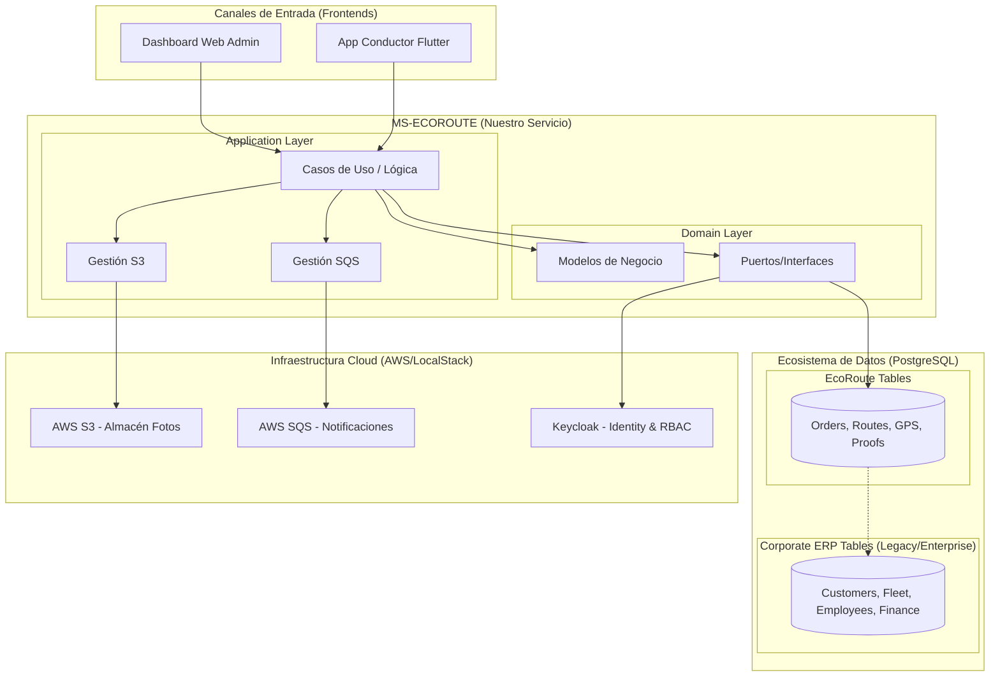

# EcoRoute Logistics Management System 🚀

## 📌 Resumen del Proyecto
**EcoRoute** es la solución tecnológica estratégica de la empresa **"TransLogística Express S.A.C."** para la optimización de la logística de última milla. 

Mientras que la corporación cuenta con un ecosistema de gestión empresarial (ERP) para finanzas, RRHH y almacenes, **EcoRoute** nace como un microservicio especializado para resolver los desafíos críticos de trazabilidad en tiempo real, asignación inteligente de rutas y evidencias digitales, eliminando la dependencia de procesos manuales basados en papel y Excel.

---

## 🏗️ Arquitectura Global del Sistema

El sistema opera bajo un enfoque de **Microservicios** y **Arquitectura Hexagonal**, coexistiendo dentro de un ecosistema de datos corporativo robusto.

### Diagrama de Arquitectura de Servicio e Integración Corporativa:


---

## 🛠️ Tecnologías Utilizadas
- **Backend:** Java 17, Spring Boot 3.5.x, Project Reactor (Mono/Flux).
- **Persistencia:** R2DBC, PostgreSQL, Flyway.
- **Servicios Cloud (LocalStack):** Simulación de AWS S3 y AWS SQS.
- **Seguridad:** Spring Security OAuth2, Keycloak (RBAC).
- **Testing:** JUnit 5, Mockito, StepVerifier, Testcontainers.
- **Documentación:** Swagger (OpenAPI 3), Postman.

---

## 🏛️ Ecosistema de Datos Corporativo (ERP-Level)
La base de datos del proyecto no solo contiene las tablas operativas de EcoRoute, sino que simula un entorno empresarial real de **TransLogística Express S.A.C.** mediante los esquemas `corp_*`:
- **Gestión de Sedes y Departamentos:** Control organizacional a nivel nacional.
- **Recursos Humanos Corporativos:** Planilla global de empleados y gerencia.
- **CRM & Facturación:** Base de datos de clientes retail (**Saga, Ripley, Mercado Libre**) y facturación electrónica.
- **Gestión de Mantenimiento de Flota:** Historial técnico preventivo y correctivo de vehículos.

Este diseño asegura que el microservicio pueda escalar e integrarse con otros módulos de la empresa en el futuro, manteniendo una visión de **empresa real de 360 grados**.

---

## 🚀 Guía de Inicio Rápido

### Requisitos Previos:
- Docker & Docker Compose.
- Java 17+.

### Configuración del Entorno:
1.  Copia el archivo `.env` de ejemplo:
    ```env
    DB_USER=user
    DB_PASSWORD=password
    DB_NAME=ecoroute
    SPRING_PROFILES_ACTIVE=local
    ```

### Ejecución con Docker:
Para levantar la base de datos, Keycloak y LocalStack (S3/SQS):
```bash
docker-compose up -d
```
El script `infra/localstack/init-aws.sh` inicializará automáticamente el bucket S3 (`ecoroute-proofs`) y la cola SQS (`ecoroute-notifications`).

### Ejecución del Backend:
```bash
# Opción 1: Local (Conectándose a Docker para DB/AWS)
./gradlew bootRun --args='--spring.profiles.active=local'

# Opción 2: Dentro de Docker (Todo el stack integrado)
docker-compose build
docker-compose up -d
```

---

## 🔒 Modelo de Seguridad (RBAC)
El sistema implementa un control de acceso basado en roles granular:
- **ADMIN:** Acceso total a configuraciones, rutas y métricas.
- **DISPATCHER:** Gestión de pedidos y planificación de rutas.
- **DRIVER:** Acceso limitado a ver sus rutas asignadas y subir evidencias.

La estructura de tablas `auth_*` permite definir permisos por **Módulo -> Recurso -> Acción**.

---

## 📡 Endpoints Principales (API)
- `POST /orders`: Creación de pedidos detallados.
- `POST /routes`: Planificación de rutas logísticas.
- `POST /gps/ping`: Actualización de ubicación en tiempo real.
- `POST /delivery-proofs`: Registro de evidencias (Foto/Firma) + Actualización automática a 'Entregado'.
- `GET /dashboard/orders-by-status`: Estadísticas para el panel administrativo.

*(Ver `EcoRoute_Postman_Collection.json` para la documentación completa de la API).*

---

## 🔮 Visión a Futuro y Deuda Técnica
1.  **Dashboard Web (React):** Panel administrativo para despacho y monitoreo de mapas.
2.  **App Móvil (Flutter):** Aplicativo para conductores con modo Offline-First.
3.  **Analítica Predictiva:** Implementación de modelos para predecir tiempos de entrega basados en historial.
4.  **Despliegue Cloud:** Migración a AWS (ECS/EKS + RDS) como fase final de producción.

---
**Desarrollado como Proyecto Integrador - 2026**
