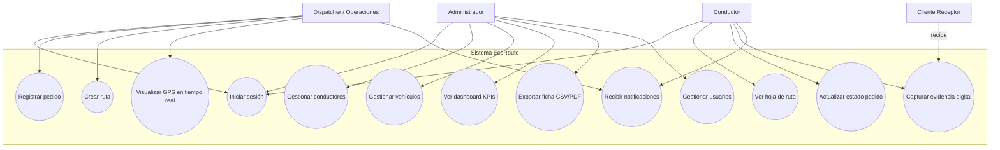
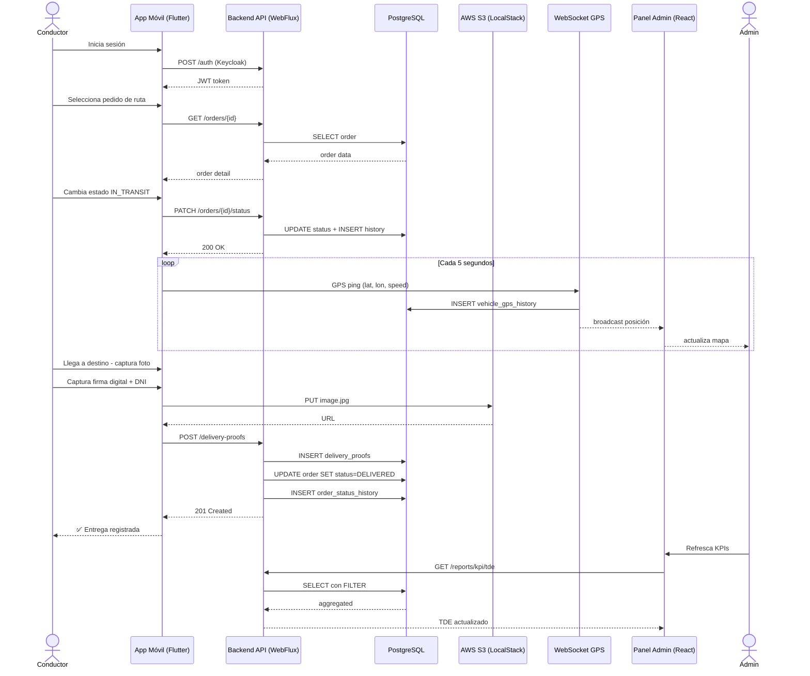
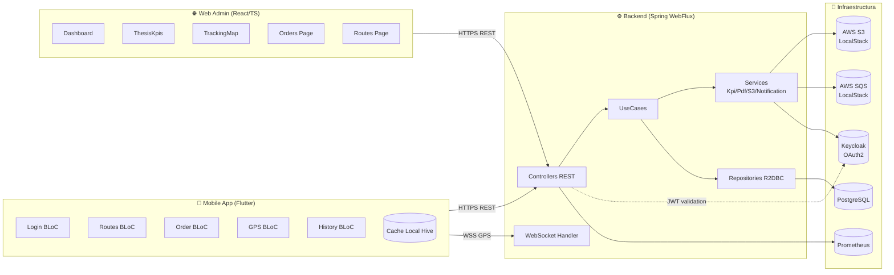
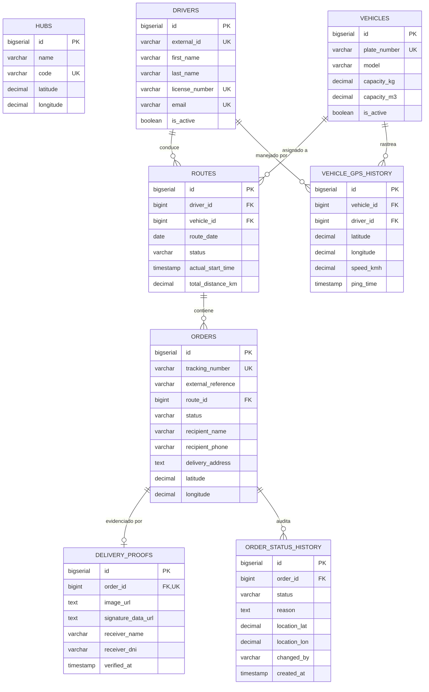
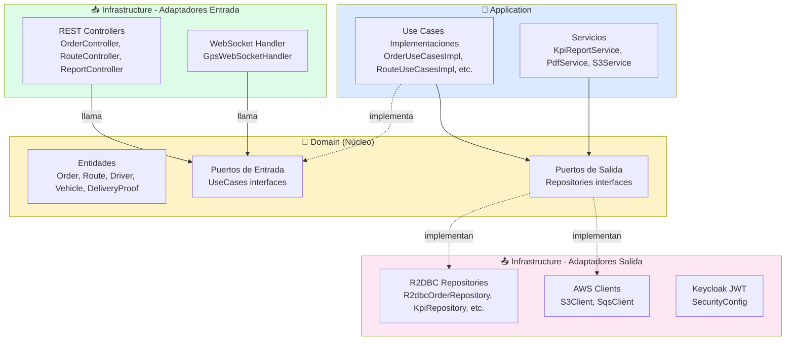
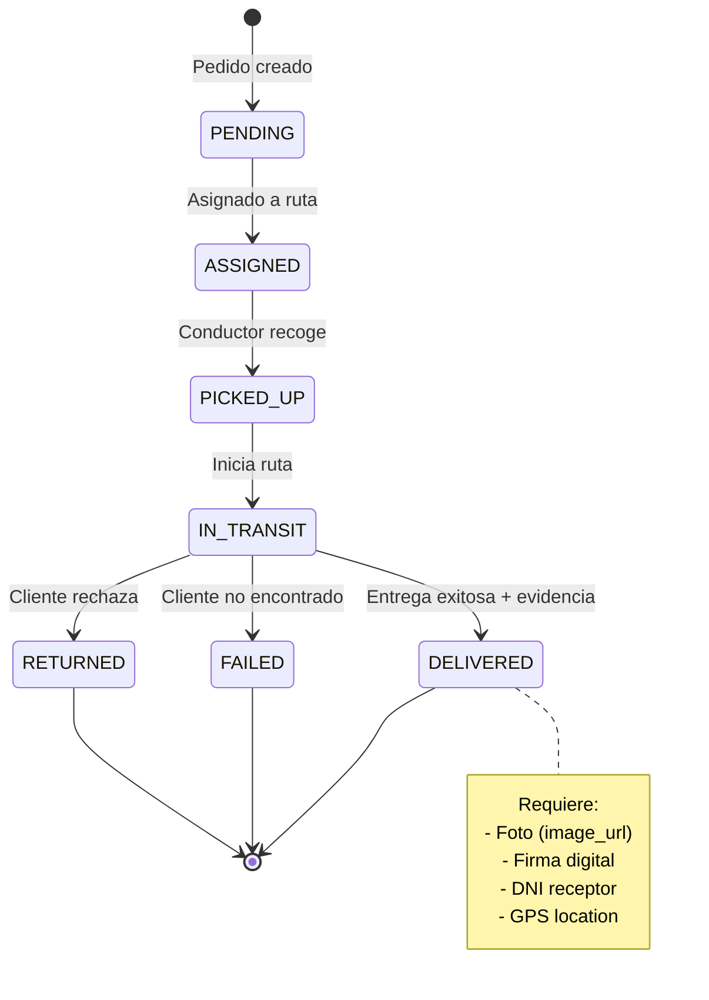

# Diagramas UML — Sistema EcoRoute

Los siguientes diagramas están en formato **Mermaid**, que se puede renderizar:
- Directamente en GitHub (al ver este `.md`)
- En **draw.io** (importar como Mermaid)
- En **Mermaid Live Editor**: https://mermaid.live/
- En Notion (bloque `code` con lenguaje `mermaid`)
- En Word/PPT: copiar el SVG generado en Mermaid Live

---

## 1. Diagrama de Casos de Uso



---

## 2. Diagrama de Secuencia — Flujo de Entrega



---

## 3. Diagrama de Componentes



---

## 4. Diagrama Entidad-Relación (E-R)



---

## 5. Diagrama de Arquitectura Hexagonal



---

## 6. Diagrama de Estados — Ciclo de Vida del Pedido



---

## Cómo exportar a imagen para Word

1. Copia el bloque mermaid completo (entre los ` ```mermaid ` y ` ``` `).
2. Abre https://mermaid.live/
3. Pega en el editor.
4. Clic en **Actions → SVG** o **PNG** para descargar.
5. Inserta la imagen en la tesis con caption "Figura N°XX: …".

## Mapeo a figuras del documento

| Diagrama | Figura tesis |
|---|---|
| 1. Casos de Uso | Figura 5 (a agregar en Anexo 8 §2.2) |
| 2. Secuencia (entrega) | Figura 6 |
| 3. Componentes | Figura 7 |
| 4. E-R | Figura 8 |
| 5. Arquitectura Hexagonal | Figura 9 |
| 6. Estados del pedido | Figura 10 |
